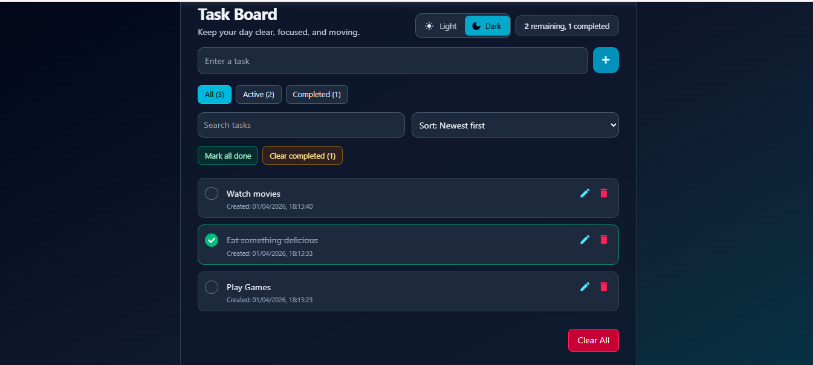

# To-Do List

A simple and responsive task management site built with React, Vite, Tailwind CSS v4, and React Icons.

## Features

- Add a new task
- Mark a task as complete/incomplete
- Delete an individual task
- Clear all tasks
- Persist tasks in localStorage
- Robust storage handling for malformed data
- Accessibility labels for icon-only action buttons

## Tech Stack

- React 19
- Vite 6
- Tailwind CSS 4
- React Icons
- ESLint 9

## Project Structure

src/
- App.jsx
- components/
    - TaskDashboard.jsx
	- TaskInput.jsx
	- TaskList.jsx
	- TaskItem.jsx
- hooks/
	- useLocalStorageTasks.js
- index.css

## Getting Started

1. Install dependencies:

```bash
npm install
```

2. Start the development server:

```bash
npm run dev
```

3. Build for production:

```bash
npm run build
npm run preview
```

## Screenshot



Place your screenshot at `public/todo-screenshot.png`.
